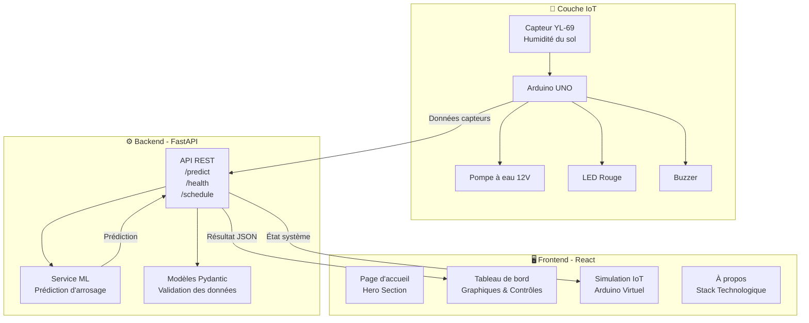
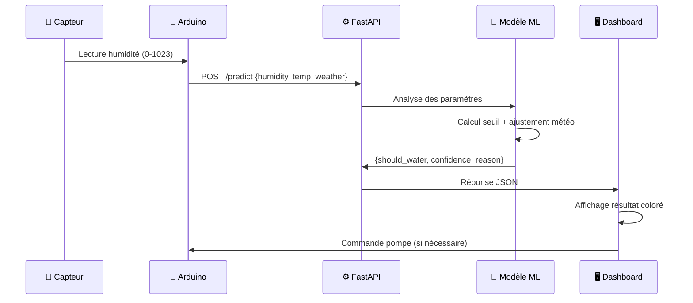
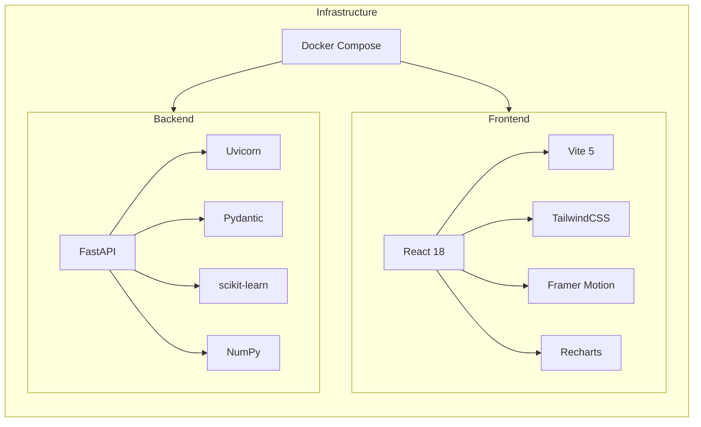
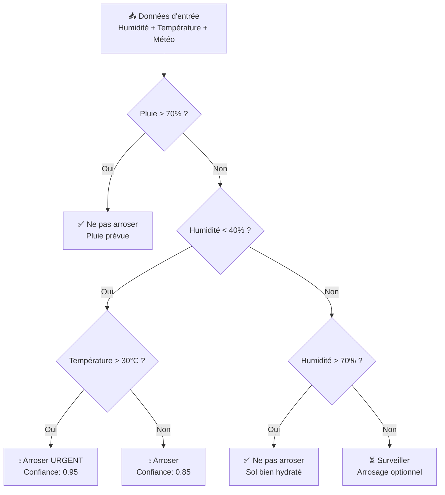

# 🌱 Système Intelligent de Soin des Plantes

<div align="center">

**Un système IoT intelligent alimenté par l'IA pour surveiller et automatiser l'arrosage des plantes**

[](https://python.org)
[](https://reactjs.org)
[](https://fastapi.tiangolo.com)
[](https://tailwindcss.com)
[](https://docker.com)
[](LICENSE)
[](README.md#-équipe)

</div>

---

## 📋 Table des Matières

- [À propos du projet](#-à-propos-du-projet)
- [Fonctionnalités clés](#-fonctionnalités-clés)
- [Architecture](#-architecture)
- [Stack technologique](#-stack-technologique)
- [Captures d'écran](#-captures-décran)
- [Démarrage rapide](#-démarrage-rapide)
- [Configuration Docker](#-configuration-docker)
- [Documentation API](#-documentation-api)
- [Structure du projet](#-structure-du-projet)
- [Comment ça fonctionne](#-comment-ça-fonctionne)
- [Simulation IoT](#-simulation-iot)
- [Équipe](#-équipe)
- [Feuille de route](#-feuille-de-route)
- [Contribuer](#-contribuer)
- [Licence](#-licence)
- [Remerciements](#-remerciements)

---

## 🌿 À propos du projet

Le **Système Intelligent de Soin des Plantes** est une plateforme IoT complète combinant l'intelligence artificielle, la simulation de capteurs en temps réel et une interface web moderne pour révolutionner la gestion de l'arrosage des plantes.

### 💡 Pourquoi ce projet ?

- 🌍 **Conservation de l'eau** — Évite le sur-arrosage grâce à des décisions basées sur les données
- 🤖 **Agriculture intelligente** — Applique le Machine Learning pour des prédictions précises
- 📡 **IoT accessible** — Simule un système Arduino complet sans matériel physique
- 📊 **Visualisation en temps réel** — Tableau de bord interactif avec graphiques et historique

---

## ✨ Fonctionnalités clés

| Fonctionnalité | Description |
|---|---|
| 🤖 **Prédiction ML** | Algorithme d'apprentissage automatique pour décider si la plante a besoin d'eau |
| 📡 **Simulation IoT** | Simulation complète d'un Arduino UNO avec capteur YL-69, pompe et LED |
| 📊 **Tableau de bord** | Interface de contrôle avec graphiques et historique d'humidité |
| 🌦️ **Météo adaptative** | Ajustement des décisions en fonction de la météo (pluie, chaleur) |
| 🌙 **Interface sombre** | Design moderne glassmorphism avec animations fluides |
| 🔌 **API REST** | Backend FastAPI haute performance avec documentation Swagger |

---

## 🏗️ Architecture

### Diagramme d'architecture système



### Flux de données



### Stack technologique par couche



---

## 🛠️ Stack technologique

### Frontend

| Technologie | Version | Rôle |
|---|---|---|
| ⚛️ React | 18 | Interface utilisateur composants |
| ⚡ Vite | 5 | Build ultra-rapide avec HMR |
| 🎨 TailwindCSS | 3 | Styles utilitaires responsifs |
| 🎬 Framer Motion | 11 | Animations professionnelles |
| 📈 Recharts | 2 | Graphiques d'humidité |
| 🔷 Lucide React | latest | Icônes modernes |
| 🧭 React Router DOM | 6 | Navigation client-side |

### Backend

| Technologie | Version | Rôle |
|---|---|---|
| 🚀 FastAPI | latest | API REST haute performance |
| 🦄 Uvicorn | latest | Serveur ASGI async |
| ✅ Pydantic | latest | Validation des données |
| 🔢 NumPy | latest | Calculs numériques |
| 🧠 scikit-learn | latest | Algorithmes ML |
| 📦 Python Multipart | latest | Gestion des formulaires |

### Infrastructure

| Technologie | Rôle |
|---|---|
| 🐳 Docker Compose | Orchestration des conteneurs |
| 🔗 CORS Middleware | Gestion des requêtes cross-origin |

---

## 📸 Captures d'écran

### 🏠 Page d'accueil

<!-- Ajouter une capture d'écran de la page d'accueil avec le hero section -->
> *Section hero avec gradient sombre, titre animé et boutons d'action*

### 📊 Tableau de bord

<!-- Ajouter une capture d'écran du dashboard avec graphiques -->
> *Slider d'humidité, panneau météo, résultats ML colorés et historique*

### 📡 Simulation IoT

<!-- Ajouter une capture d'écran de la simulation Arduino -->
> *Arduino UNO virtuel avec capteur, pompe, LED, buzzer et moniteur série*

### ℹ️ À propos

<!-- Ajouter une capture d'écran de la page À propos -->
> *Présentation de l'équipe et de la stack technologique*

---

## 🚀 Démarrage rapide

### Prérequis

- [Node.js](https://nodejs.org/) v18+
- [Python](https://python.org/) 3.10+
- [Docker](https://docker.com/) & Docker Compose *(optionnel)*
- npm ou yarn

### Installation — Frontend

```bash
# Cloner le dépôt
git clone https://github.com/votre-org/smart-plant-care.git
cd smart-plant-care/frontend

# Installer les dépendances
npm install

# Lancer en mode développement
npm run dev
```

L'application sera disponible sur `http://localhost:5173`

### Installation — Backend

```bash
cd smart-plant-care/backend

# Créer un environnement virtuel
python -m venv venv

# Activer l'environnement (Linux/Mac)
source venv/bin/activate

# Activer l'environnement (Windows)
venv\Scripts\activate

# Installer les dépendances
pip install -r requirements.txt

# Lancer le serveur
uvicorn app.main:app --reload --host 0.0.0.0 --port 8000
```

L'API sera disponible sur `http://localhost:8000`  
La documentation Swagger sera sur `http://localhost:8000/docs`

---

## 🐳 Configuration Docker

Lancer l'ensemble du projet (frontend + backend) en une seule commande :

```bash
cd smart-plant-care

# Lancer tous les services
docker-compose up --build

# Lancer en arrière-plan
docker-compose up -d --build

# Arrêter les services
docker-compose down
```

| Service | URL |
|---|---|
| 🖥️ Frontend | http://localhost:5173 |
| ⚙️ Backend API | http://localhost:8000 |
| 📖 Documentation API | http://localhost:8000/docs |

---

## 📖 Documentation API

### Endpoints disponibles

| Méthode | Endpoint | Description |
|---|---|---|
| `GET` | `/` | Informations API et endpoints disponibles |
| `GET` | `/health` | Vérification de santé avec seuil d'humidité |
| `POST` | `/predict` | Prédiction ML d'arrosage |
| `GET` | `/schedule/{humidity}` | Planning d'arrosage recommandé |

### Prédiction — Requête

**`POST /predict`**

```json
{
  "humidity": 35.0,
  "temperature": 28.0,
  "weather_condition": "sunny"
}
```

**Paramètres :**

| Paramètre | Type | Description |
|---|---|---|
| `humidity` | float (0-100) | Humidité du sol en % |
| `temperature` | float | Température en °C |
| `weather_condition` | string | Conditions météo (`sunny`, `cloudy`, `rainy`) |

### Prédiction — Réponse

```json
{
  "should_water": true,
  "message": "💧 Arroser la plante",
  "confidence": 0.92,
  "reason": "Humidité sous le seuil critique (40%)",
  "timestamp": "2026-04-19T12:00:00"
}
```

### Planning d'arrosage — Réponse (humidité < 30%)

```json
{
  "frequency": "Quotidien",
  "duration": "5-10 minutes",
  "best_time": "Matin (6h-8h)"
}
```

---

## 📁 Structure du projet

```
smart-plant-care/
├── backend/
│   ├── app/
│   │   ├── __init__.py
│   │   ├── main.py           # Point d'entrée FastAPI
│   │   ├── models.py         # Modèles de données Pydantic
│   │   └── services.py       # Service de prédiction ML
│   ├── data/                 # Stockage des données (futur)
│   ├── docker-compose.yml    # Orchestration Docker
│   ├── requirements.txt      # Dépendances Python
│   └── venv/                 # Environnement virtuel Python
│
└── frontend/
    ├── public/
    ├── src/
    │   ├── assets/
    │   ├── components/
    │   │   ├── Navbar.jsx    # Barre de navigation
    │   │   └── Navbar.css
    │   ├── pages/
    │   │   ├── Home.jsx          # Page d'accueil
    │   │   ├── Home.css
    │   │   ├── Dashboard.jsx     # Tableau de bord ML
    │   │   ├── Dashboard.css
    │   │   ├── IoTSimulation.jsx # Simulation Arduino
    │   │   ├── IoTSimulation.css
    │   │   ├── About.jsx         # Page À propos
    │   │   └── About.css
    │   ├── App.jsx           # Application principale avec routing
    │   ├── App.css
    │   ├── main.jsx          # Point d'entrée
    │   └── index.css         # Styles globaux
    ├── index.html
    ├── package.json
    ├── vite.config.js
    ├── tailwind.config.js
    ├── postcss.config.js
    └── eslint.config.js
```

---

## 🧠 Comment ça fonctionne

### Logique de prédiction ML



**Étapes du traitement :**

1. **Lecture des paramètres** — Humidité du sol (0-100%), température (°C), condition météo
2. **Vérification météo** — Si probabilité de pluie > 70%, annuler l'arrosage
3. **Analyse du seuil** — Comparaison avec le seuil critique (40%)
4. **Ajustement thermique** — Chaleur > 30°C + sol sec → priorité haute
5. **Calcul de confiance** — Score entre 0 et 1 basé sur les conditions
6. **Retour de la décision** — `should_water` + message + raison + timestamp

---

## 📡 Simulation IoT

### Mappage des broches Arduino

| Composant | Broche | Type | Description |
|---|---|---|---|
| Capteur YL-69 | A0 | Analogique | Lecture humidité sol (0-1023) |
| Pompe à eau 12V | D7 | Numérique | Activation pompe |
| LED rouge | D8 | Numérique | Indicateur d'état |
| Buzzer | D9 | Numérique | Alarme sonore |

### Seuils du capteur

| Valeur brute | Humidité (%) | État |
|---|---|---|
| 0 – 300 | 70 – 100% | 🟢 Sol bien hydraté |
| 300 – 600 | 40 – 70% | 🟡 Humidité modérée |
| 600 – 800 | 20 – 40% | 🟠 Sol sec — surveiller |
| 800 – 1023 | 0 – 20% | 🔴 Sol très sec — arroser |

### Modes de fonctionnement

<details>
<summary>⚡ Mode Automatique</summary>

- Le système surveille en continu la valeur du capteur (toutes les 2 secondes)
- Si la valeur brute > 400 (humidité < 60%) → la pompe s'active automatiquement
- La LED s'allume et le buzzer émet un signal lors de l'activation
- La pompe s'arrête automatiquement quand le seuil est atteint
- Simulation de fluctuation réaliste des valeurs capteur

</details>

<details>
<summary>🎮 Mode Manuel</summary>

- L'utilisateur contrôle directement la pompe via l'interface
- Activation/désactivation instantanée de la pompe
- LED et buzzer répondent aux commandes manuelles
- Les logs système enregistrent toutes les actions avec timestamp
- Historique des 20 dernières lectures du capteur

</details>

### Animations visuelles

- 🌀 **Rotor de pompe** — Animation rotative lors de l'activation
- 💧 **Gouttes d'eau** — Animation de chute lors de l'arrosage
- 💡 **Halo LED** — Effet lumineux sur la LED rouge
- 📟 **Moniteur série** — Simulation console Arduino à 9600 baud
- 🌱 **Sonde visuelle** — Gradient d'humidité dans le sol

---

## 👥 Équipe

Nous sommes **l'Équipe 3** — une équipe pluridisciplinaire d'ingénieurs marocains passionnés par les technologies intelligentes.

| Nom | Spécialisation | Filière / Ville |
|---|---|---|
| **Marouane Dagana** | Génie Logiciel & Développement | IL / Marrakech |
| **Zineb Lagrida** | Intelligence Artificielle & Machine Learning | ADIA / Salé |
| **Ilhame Benaazzouz** | Internet des Objets (IoT) | IISE / Youssoufia |

---

## 🗺️ Feuille de route

### Version 1.0 (actuelle) ✅

- [x] API REST FastAPI avec prédiction ML
- [x] Tableau de bord React interactif
- [x] Simulation IoT Arduino complète
- [x] Interface sombre glassmorphism
- [x] Déploiement Docker Compose

### Version 2.0 (planifiée) 🔜

- [ ] 📱 **Application mobile** — Version iOS & Android (React Native)
- [ ] ☁️ **Déploiement cloud** — AWS / Azure / GCP avec CI/CD
- [ ] 🌡️ **Capteurs réels** — Intégration matérielle Arduino physique
- [ ] 🌿 **Base de données plantes** — Profils spécifiques par espèce végétale
- [ ] 🔔 **Notifications push** — Alertes en temps réel sur mobile
- [ ] 📊 **Analytics avancés** — Tableaux de bord historiques et statistiques
- [ ] 🤝 **Multi-utilisateurs** — Gestion de plusieurs jardins/plantes
- [ ] 🌐 **Internationalisation** — Support multilingue complet

---

## 🤝 Contribuer

Les contributions sont les bienvenues ! Voici comment participer :

1. **Forker** le dépôt
2. **Créer** une branche feature (`git checkout -b feature/ma-fonctionnalite`)
3. **Committer** vos changements (`git commit -m 'Ajouter ma fonctionnalité'`)
4. **Pousser** vers la branche (`git push origin feature/ma-fonctionnalite`)
5. **Ouvrir** une Pull Request

### Conventions de code

- Utiliser des messages de commit clairs en français ou en anglais
- Suivre les règles ESLint pour le frontend
- Respecter les conventions PEP 8 pour le backend
- Documenter les nouvelles fonctions et composants

---

## 📄 Licence

Ce projet est distribué sous la licence **MIT**. Voir le fichier [LICENSE](LICENSE) pour plus d'informations.

```
MIT License — Copyright (c) 2026 Équipe 3
```

---

## 🙏 Remerciements

- 🎓 **Nos formateurs et encadrants** pour leur soutien tout au long du projet
- ⚛️ L'équipe **React** pour un framework frontend exceptionnel
- 🚀 L'équipe **FastAPI** pour un framework backend élégant et performant
- 🧠 La communauté **scikit-learn** pour les outils ML open-source
- 📡 La communauté **Arduino** pour l'inspiration IoT
- 🐳 **Docker** pour la containerisation simplifiée

---

<div align="center">

🌱 *Fabriqué avec passion au Maroc par notre équipe * 🌱

</div>
